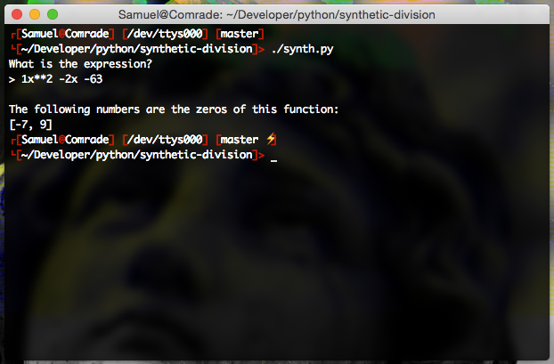

# Synthetic Division
This python script evaluates an expression and returns its zeros by using synthetic division.

Note that this program doesn't completely replace Rational Root Theorem. This is because it's only capable of identifying the **rational** zeros of a given expression.

Aslo note that due to the manner of which floating point calculations are preformed, the script only returns integers.

## Why?
I was struggling with the concept in my Algebra class, and programming always seems to help me understand mathematical procedures.

## Screens

## Usage
When entering an expression, there are a few formatting rules to ensure the equation is evaluated correctly.
The rules are as follows:
  * Exponents are denoted using the `^` sign. For example: `3x^3, 2x^2`.
  * Operators and terms should be separated by spaces. For example: `2x^2 + 1x`.
  * Invisible *1*'s and *0*'s need to be manually entered. For example: `2x^3 - 6` needs to be entered as `2x^3 + 0x^2 - 6`. This rules **DOES NOT** exclude the constant term referred to as *`k`*. This means that `2x^2 + 4x` needs the be entered as `2x^2 + 4x + 0`.

## TODO
- [x] Update the parser for better equation inputting options
    * Repalce `**` with `^` to denote exponents
    * Make rules between operators and terms more clear
- [ ] Refactor logic so that "invisible" 1's and 0's don't have to be manually entered
- [ ] Print a Synthetic Division Table
- [x] Print if some zeros are complex (Use Fundamental Theorem of Algebra)
- [ ] Some sort of Graph?
